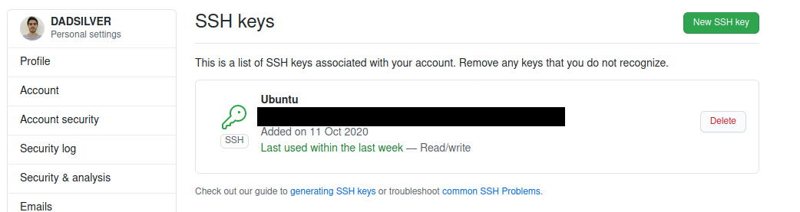
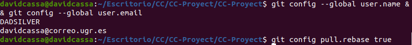

### Hito 0

# 1 Creación de par clave pública/privada SSH

En primer lugar tenemos que generar la claves usando en la linea de comandos `ssh-keygen -t rsa -b 4096 -C"`, una vez generada la clave nos vamos al fichero en el que se ha generado la clave y la copiamos. Entonces vamos a nuestra cuenta de GitHub nos situamos en settings>SSH and GPG keys>New SSH key e introducimos la clave que hemos generado para vincularlo con el ordenador que vamos a utilizar.

Así quedaría despues de haber realizado los pasos anteriores.

# 2 Creación de respositorios para la asignatura: ejercicios de autoevaluación, proyecto y fork de la asignatura.

- [Ejercicios de autoevaluación](https://github.com/DADSILVER/CC-Ej-Evaluacion)
- [Proyecto](https://github.com/DADSILVER/CC-Proyect)
- [Fork de la asignatura](https://github.com/DADSILVER/CC-20-21)

# 3 Configuración de los remotes correctos par ael repositorio CC-20-21

Configuramos los remotes con la orden `git remote add upstream https://github.com/JJ/CC-20-21.git` ejecutada en el directorio en el que hayamos hecho el fork.

Para comprobar que hemos realizado bien orden usamos `git remote -v`, en la cual nos saldra el directorio de [las prácticas](https://github.com/JJ/CC-20-21).

# 4 Configuración de git local correcta: nombre, dirección de correo electrónico, configuración de rebase

Para configurar el nombre el email y el rebase se usaran las ordenes mostradas en la imagen

# 5 Primer ejercidio de autoevaluación

- [Ejercicio 1](https://github.com/DADSILVER/CC-Ej-Evaluacion/blob/main/Tema%201/Ejercicio1.md)

# 6 Segundo ejercicio de la autoevaluación

- [Ejercicio 2](https://github.com/DADSILVER/CC-Ej-Evaluacion/blob/main/Tema%201/Ejercicio%202.md)

